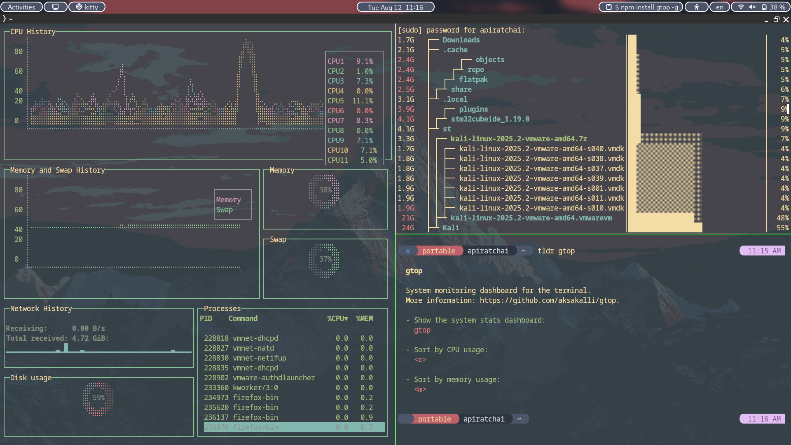

# Dotfiles

- OS: Debian GNU/Linux 12 (bookworm)
- Kernel: 6.1.0-37-amd64
- Shell: zsh 5.9 
- DE: GNOME 43.9
- WM: Mutter
- Terminal: kitty
- Theme: Adwaita [GTK2/3]
- Icons: Adwaita [GTK2/3]
---

## Contents
- [Utilities](#utilities)
- [Kitty Terminal](#kitty-terminal)  
- [Zsh Configuration (.zshrc)](#zsh-configuration-zshrc)  
- [GNOME Extensions](#gnome-extensions)
- [Color palette](#color-palette)

---

## Utilities
credits : https://github.com/ibraheemdev/modern-unix 
- [bat](https://github.com/sharkdp/bat) : A `cat` clone with syntax highlighting and Git integration.
- [lsd](https://github.com/Peltoche/lsd) : The next gen file listing command. Backwards compatible with `ls`.
- [gtop](https://github.com/aksakalli/gtop) : System monitoring dashboard for terminal.
- [dust](https://github.com/bootandy/dust) : A more intuitive version of `du` written in rust.
- [tldr](https://github.com/tldr-pages/tldr) : A community effort to simplify `man` pages with practical examples.

  
`gtop` on left, `dust` on top-right, `tldr` on bottom-right.

## Kitty Terminal

- nightly kitty built. ( v.0.37.0 or newer should work )
    ```bash
    curl -L https://sw.kovidgoyal.net/kitty/installer.sh | sh /dev/stdin \
    installer=nightly
    ```
- theme: Desert

    ```bash
    THEME=https://raw.githubusercontent.com/dexpota/kitty-themes/master/themes/Desert.conf
    wget "$THEME" -P ~/.config/kitty/kitty-themes/themes
    ```
    ```bash
    cd ~/.config/kitty
    ln -s ./kitty-themes/themes/Desert.conf ~/.config/kitty/theme.conf
    ```
- custom theme (currently using): inspired by Everforest Theme  
[github.com/bgrnwd/everforest-kitty](https://github.com/bgrnwd/everforest-kitty)  
hard coded into `~/.config/kitty/kitty.conf`

---

## Zsh Configuration (.zshrc)

- Zsh shell setup with plugins and aliases.
- fix nvm performance issue on load  
    guide here [varun.ch/posts/slow-nvm/](https://varun.ch/posts/slow-nvm/)
- Oh-My-Zsh.
- theme: Comfyline (custom)
    - [gitlab.com/imnotpua/comfyline_prompt.git](https://gitlab.com/imnotpua/comfyline_prompt)
- Config file path:
    - `~/.zshrc`
    - `~/.oh-my-zsh/custom/themes/`


---

## GNOME Extensions

- List of GNOME extensions I use to improve desktop productivity.  
- Installation via GNOME Extensions website.
- Extentions used:  
  - [**Blur My Shell**](https://github.com/aunetx/blur-my-shell) — add blur to gnome shell  
  - [**Clipboard Histroy**](https://github.com/SUPERCILEX/gnome-clipboard-history) — clipborad manager
  - [**Hibernate Status Button**](https://github.com/arelange/gnome-shell-extension-hibernate-status)
  - [**Open Bar**](https://github.com/neuromorph/openbar)
  - [**Rounded Window Corners**](https://github.com/yilozt/rounded-window-corners)
  - [**Show Desktop Applet**](https://github.com/Valent-in/Show-Desktop-Applet) — add windows-like show desktop icon and shortkey
  - [**Tiling Assistant**](https://github.com/Leleat/Tiling-Assistant) — better tiling tool

---

## Color palette
for Open Bar and firefox theme
  
  
Extracted from wallpaper
  


---

Feel free to explore and adapt
